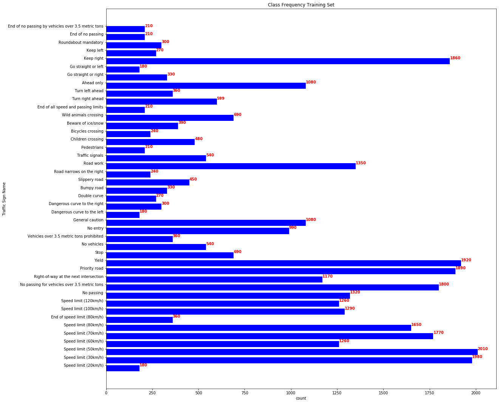
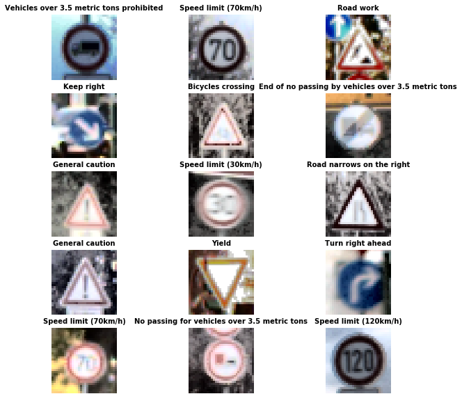
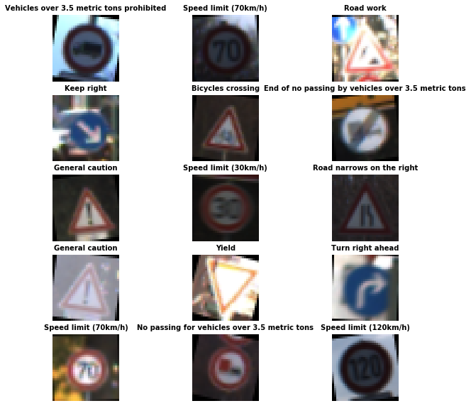
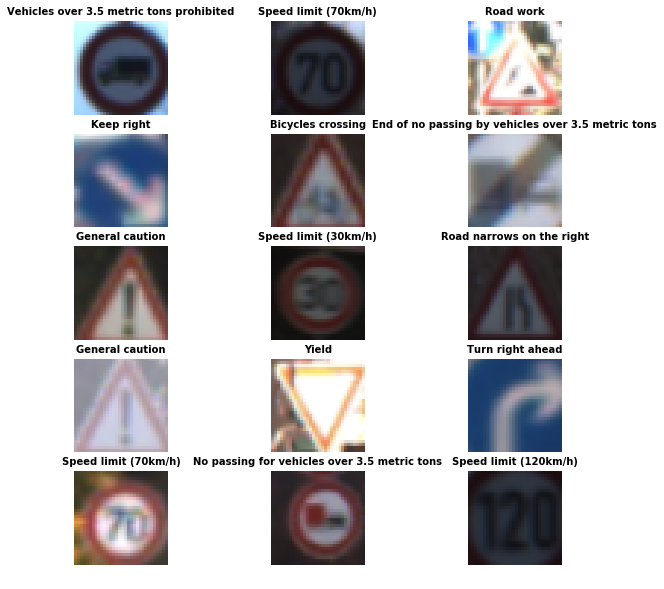
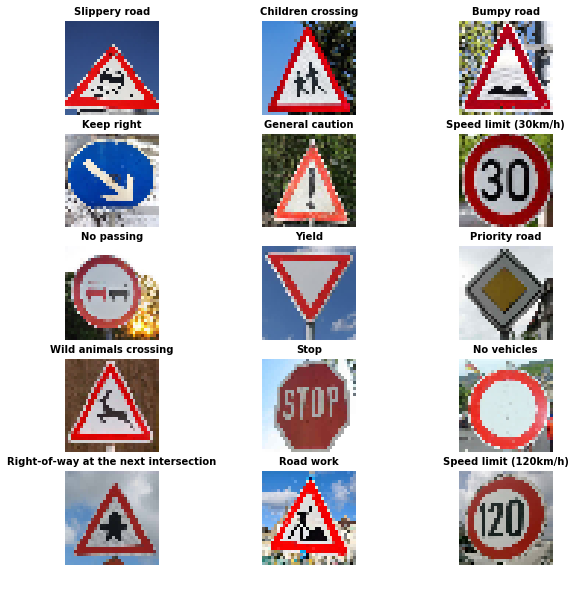
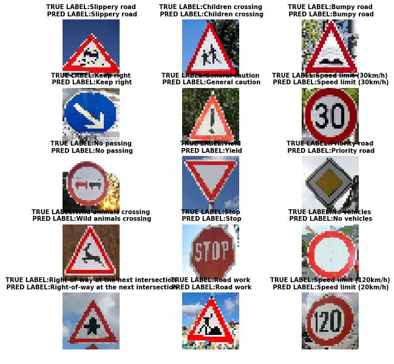
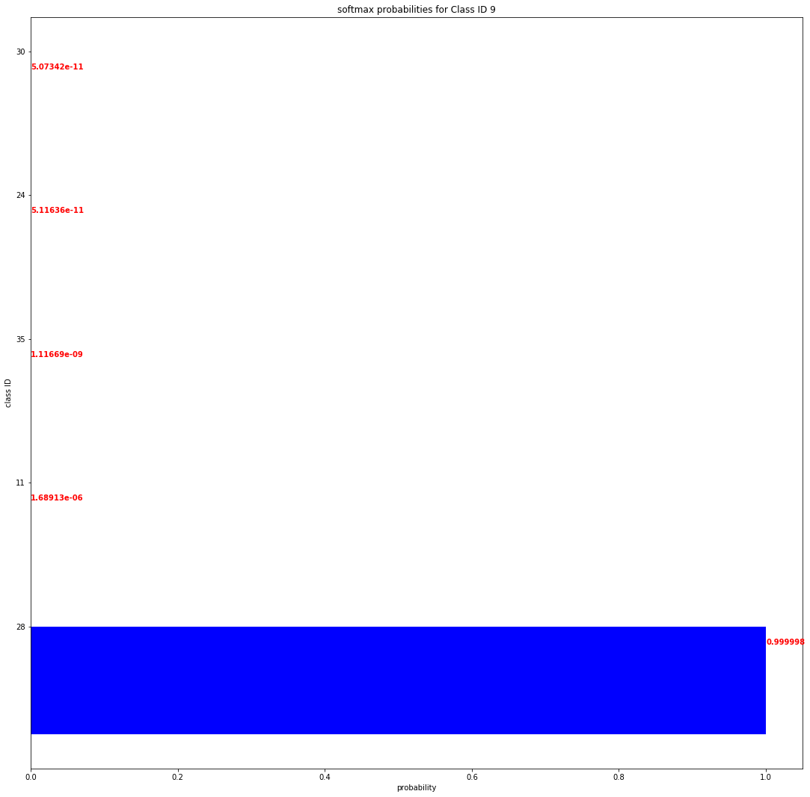
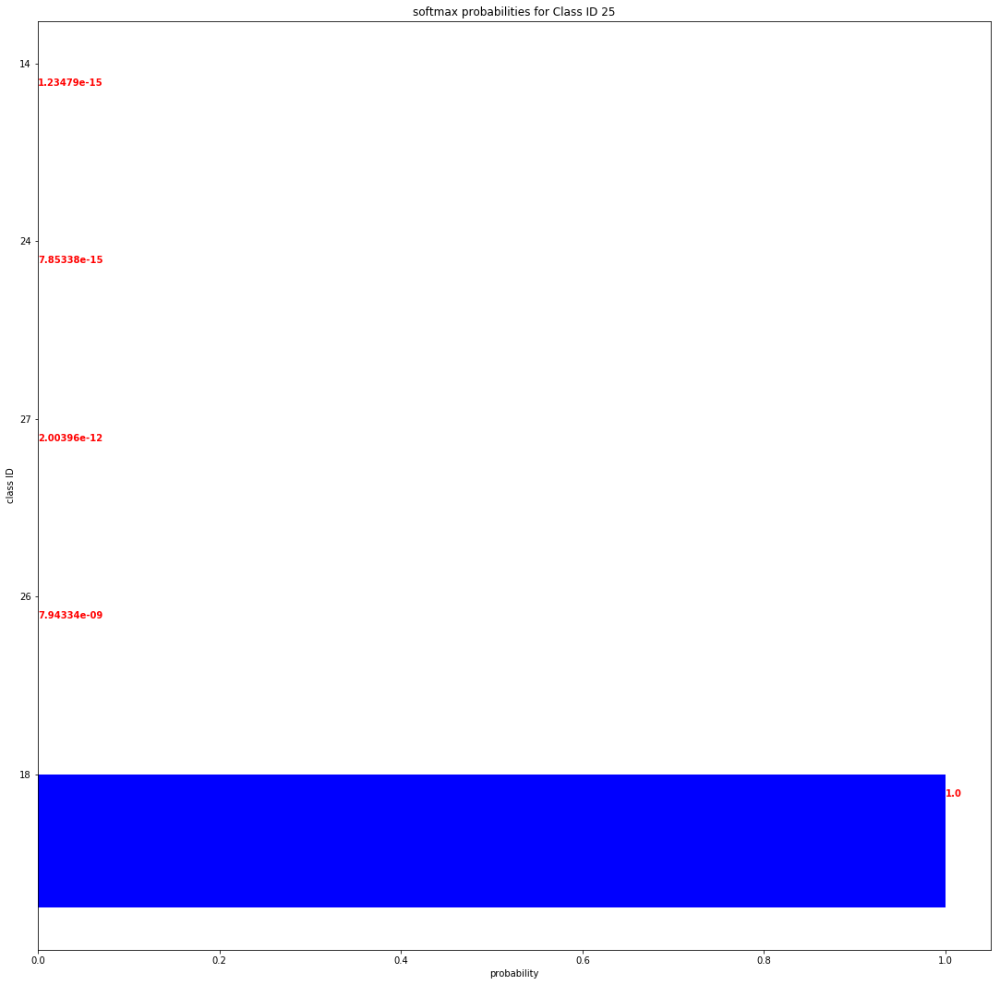
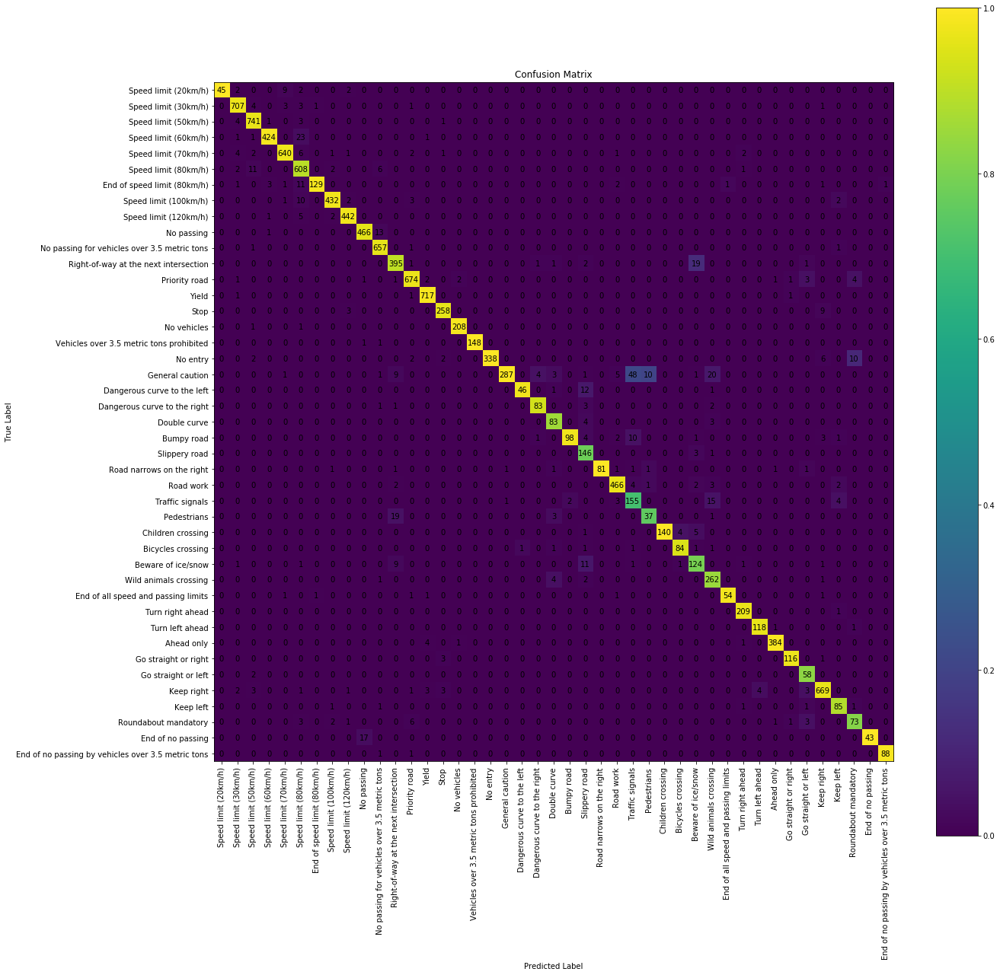
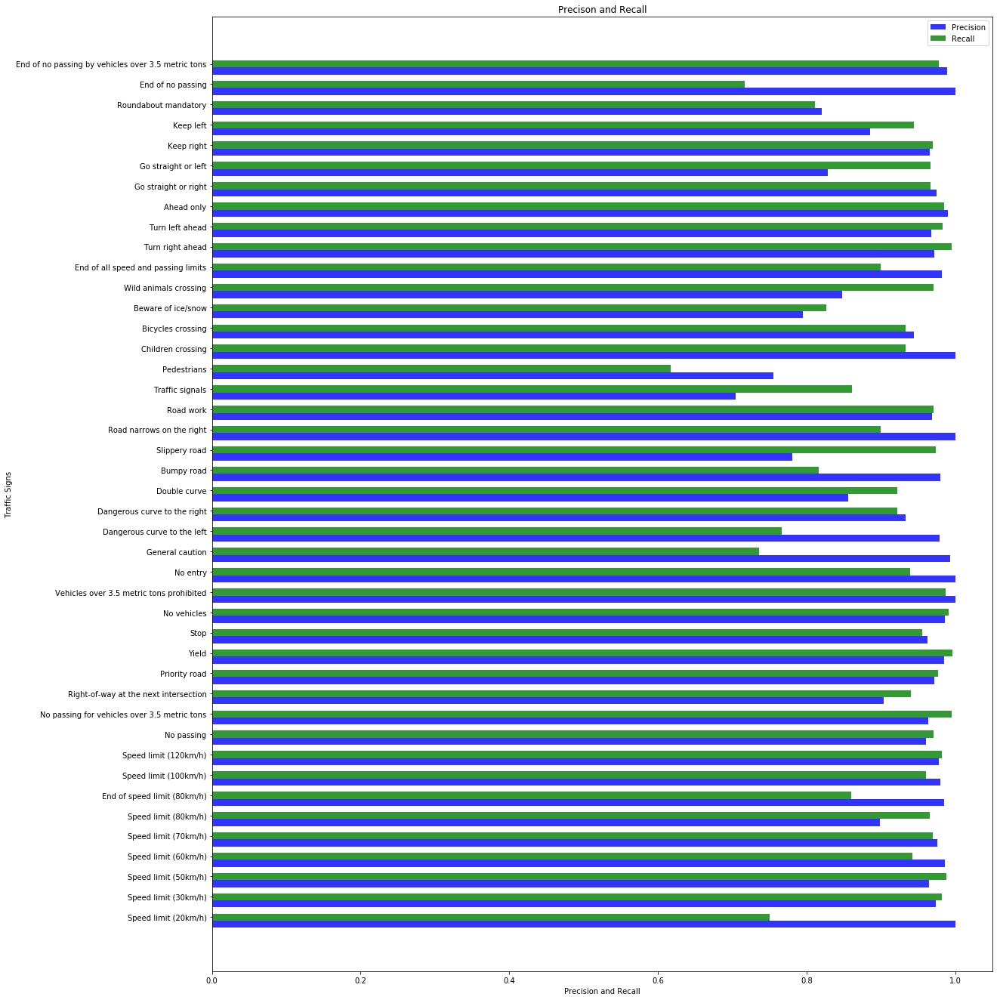

# Traffic Sign Recognizer 

The [German Traffic Sign Recognition Benchmark](http://benchmark.ini.rub.de/?section=gtsrb&subsection=dataset) (GTSRB) is a multi class benchmark with 43 classes of Traffic signs with unbalanced class frequencies, totalling 50k images of traffic signs. 

The benchmark captures real world examples of traffic signs as it reflects th strong variations in visual appearance of signs due to distance, illumination, weather conditions, partial occlusion, and rotations. 

Building a traffic sign recognizer for GTRSB involved the following steps
* Exploratory Visualization 
* Model Architecture Creation and Evolution 
* Model Evaluation 

## Step 0: Exploratory Visualization 

It is an essential task in any machine learning modelling activity to get an exploratory overview of  your data. This helps in improving the performance by tuning parameters to suit your data. 

Below is a sample of images from the taining set. 

#### Visualization of class label frequencies

Training samples in the provided dataset are unbalanced, ie the number of training samples for classes are different. 

Class ids with corresponding Class Names

                                   
    0                                  Speed limit (20km/h)
    1                                  Speed limit (30km/h)
    2                                  Speed limit (50km/h)
    3                                  Speed limit (60km/h)
    4                                  Speed limit (70km/h)
    5                                  Speed limit (80km/h)
    6                           End of speed limit (80km/h)
    7                                 Speed limit (100km/h)
    8                                 Speed limit (120km/h)
    9                                            No passing
    10         No passing for vehicles over 3.5 metric tons
    11                Right-of-way at the next intersection
    12                                        Priority road
    13                                                Yield
    14                                                 Stop
    15                                          No vehicles
    16             Vehicles over 3.5 metric tons prohibited
    17                                             No entry
    18                                      General caution
    19                          Dangerous curve to the left
    20                         Dangerous curve to the right
    21                                         Double curve
    22                                           Bumpy road
    23                                        Slippery road
    24                            Road narrows on the right
    25                                            Road work
    26                                      Traffic signals
    27                                          Pedestrians
    28                                    Children crossing
    29                                    Bicycles crossing
    30                                   Beware of ice/snow
    31                                Wild animals crossing
    32                  End of all speed and passing limits
    33                                     Turn right ahead
    34                                      Turn left ahead
    35                                           Ahead only
    36                                 Go straight or right
    37                                  Go straight or left
    38                                           Keep right
    39                                            Keep left
    40                                 Roundabout mandatory
    41                                    End of no passing
    42    End of no passing by vehicles over 3.5 metric ...
    Name: SignName, dtype: object

## Step 1:Data Augmentation

Given the limited number of training samples, its hard to capture all variations in the data to make the neural network insensitive to it. Following data augmentation techniques make the NN robust.
1. Histogram Equalization is a technique for adjusting image intensities to enhance contrast.
2. Random Rotation & scaling:  
3. Sharpening

#### Histogram Equalization 

Sample output of histogram equalization

#### Random Rotation 
Sample output of random rotation

#### Random Scaling 
Sample output of random scaling

#### Sharpening
Sample output of sharpening images

## Step 2:Neural Network Architecture

###  Evolution of the solution

The model architecture were evolved through multiple steps. 
1. Basic Lenet NN with color inputs: Train: 0.984063410622	Test:0.769126983862
        * convolution 1 filter 5x5x6
        * maxpooling stride 2
        * convolution 2 filter 5x5x16
        * maxpooling stride 2
        * dense 1 120
        * dropout(0.25)
        * dense 2 84
        * dropout(0.25)
        * dense output
        
 epochs 100
  This is the basic lenet architecture. The NN struggled to improve the test accuracy as I tried various combinations of adding drop out layers, changing the epochsm, adding dense layer 2. I was using the (32x32X3) color inouts assuming that color is important characteristic for signs.

2. Grayscale inputs. Train:0.9958501479	Test:0.9316666675
    Changing the inputs to gray scale greatly improves the accuracy. It seemed counterintuitive to lose all the additional color information but turns out shape of the signs is more important characteristic in classifying signs.
    
3. Augmentation of input: Train:0.9972333875	Test:0.9268766407 
    Based on previous train and test accuracies it was clear that the NN was overfitting. Augmentation of the training set is a great way to reduce the overfitting. Three different operations were peformed to augment the training set which included Histogram equalization, sharpening the image and applying random geometric transformations like scaling, rotation and cropping, increasing the training data threefold. The gains in accuracy were not noticeable. 

4. Multiscaling: Train:0.9904866236 Test:0.9296875
Based on the idea of multiscaling presented by LeCunn et al.in [Traffic Sign Recognition with Multi-Scale Convolutional Networks](http://yann.lecun.com/exdb/publis/pdf/sermanet-ijcnn-11.pdf), the output from the convolution layers was combined as input to the dense layer 1. 

5. Adding Layers:Train: 0.986397603 Test: 0.954161352
Adding additional layers greatly bumped up the test accuracy!.  This along with using [dropout and L2 regularization](https://www.cs.toronto.edu/~hinton/absps/JMLRdropout.pdf) gave an overall accuracy of 95%. The final network consists of three blocks of (2 convolutional layers with max pooling and dropout), the outputs of which are concatenated as input to dense layer 1.  

        * convolution 1 filter 3x3x16
        * convolution 2 filter 3x3x32
        * maxpooling stride 2
        * dropout(0.45)
        
        * convolution 1 filter 3x3x64
        * convolution 2 filter 5x5x128
        * maxpooling stride 2
        * dropout(0.35)
        
        * convolution 1 filter 3x3x256
        * convolution 2 filter 5x5x512
        * maxpooling stride 1
        * dropout(0.25)
        
        * dense 1 120
        * dropout(0.15)
        
        * dense 2 84
        * dropout(0.1)
        
        * dense output 43
        

## Step 3:Test a model on new Images

A set of 15 images were selected from the web. The images have interesting combinations of distortion, scaling and variety.

### Classifying new images. 
The nn performs well on the new images. Classifying 14 out 15 images correctly. The misclassified sign "Speed Limit (120kmh)" is classified as ""Speed Limit (20kmh)". The nn should be confused by this one because the two signs are visually very similar. 

The model is able to perform well on selected images.

## Step 4: Visualize Softmax probabilities
The model is able to classify the chosen new signs with high probability. 

## Step 5: Confusion Matrix and Precision-Recall

### Confusion Matrix
The confusion matrix is a good visual representation of the performance of the NN. The diagonal of the confusion matrix represents the True positives. 

Observations:
1. Rows: Its easy to quickly see what a particular sign is misclassified as by looking at the row in the figure below. For example "Right of way at the next interesection" is misclassified as "Beware of ice and snow"
2. Columns: Looking along the column, you can see what other signs can be wrongly classified as that sign. For example classification "Pedestrains" could mean a "General Caution" that has beed miscalssified.

### Precision and Recall: 
Precision addresses the question "Given a positive example from a classifier, how likely is it to be correct ?"
while recall addresses the question "Given a positive example, will the classifier detect it. 

Interesting observations: 
1. High Precision Low Recall : "Speed limit (20kmph)" has high precision but low recall. If nn classifies the sign as "Speed limit (20kmph" There is a high chance it is true but the low recall means it will mis classify "Speed limit (20kmph" as some thing else. The "Speed limit (20kmph" has a high change of being misclassified as "Speed limit (70kmph)" as seen in the confusion matrix.
From the self driving car perspective, if the nn classifies the sign with high precision, I would have high confidence that it is true. A low recall value means the sign was recognized as another sign, which could be dangerous.

2. High Recall Low Precision: "Traffic signals" has high recall but low precision. This means the NN was able to identify most of the signs which were "Traffic signals" but many times what was classified as "Traffic signals" was another class. Looking athe confusion matrix, signs with Label "General Caution" were misclassified as "Traffic signals".From the self driving car perspective, if the nn classifies the sign with low precision means that there is a high change that it can be another sign. A high recall value indicates that the nn will recognize the sign most of the time it is presented.

